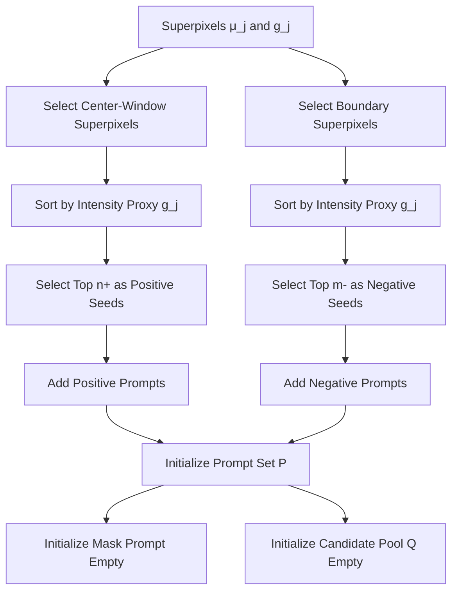

# Superpixel-Guided Iterative Prompting (SGIP)

This document combines the **method specification** (from `method_v2.md`) with
**algorithm flowcharts**. Each flowchart is provided in **Mermaid** and an image
fallback in `pics/` for easy viewing in any Markdown renderer.

---

## 0. Overview


# Method Specification (aligned with code)

## 1. Inputs / Hyper-parameters

### Required inputs
- Image: \(I\)
- Resize long side: \(L\) (default: 260). Short side scaled proportionally.
- SLIC:
  - number of superpixels: \(K\) (default: 36)
  - compactness: \(c\)
  - color space: RGB
  - sigma: \(\sigma\)
  - min size factor: \(f_{\min}\)
  - max size factor: \(f_{\max}\)

### Core hyper-parameters (tune first)
- Center window range: \([l, h]\subset(0,1)\) (`center_range`)
- Init prompt counts: positives \(n_+\), negatives \(m_-\)
- Foreground update threshold: \(\tau\) (`threshold.value`)
- Subset-point filtering: `use_subset_points`
- Convex-hull refinement: `use_convex_hull`
- Mask pool de-dup: `deduplicate_mask_pool`
- Non-convex threshold: \(\tau_{\text{convex}}\) (`convex_hull_threshold`)
- Positive-point prune distance: \(d_{\min}\)
- Mask de-dup IoU threshold: \(\tau_{\text{iou}}\) (`mask_pool_iou_threshold`)

### Secondary hyper-parameters (usually keep default)
- Candidate pool size: \(q\) (`candidate_top_k`)
- Max iterations: \(T\)
- Initial color mode: `initial_color_mode`

---

## 2. Notation

- Resized image: \(I' = \mathrm{ResizeLongSide}(I, L)\)
- Superpixel label map: \(S \in \{1,\dots,K\}^{H'\times W'}\)
- Superpixel pixel set: \(\Omega_j = \{x \mid S(x)=j\}\)
- Superpixel centroid (float): \(\mu_j\)
- Superpixel intensity proxy: \(g_j\) (mean intensity or equivalent, depending on `initial_color_mode`)
- Prompt point set: \(P = \{(u_i, y_i)\}\), \(y_i \in \{+1,-1\}\)
- Mask prompt: \(M^{\text{prompt}} \in \{0,1\}^{H'\times W'}\)

**SAM2 inference (given prompts):**
- \((\ell, M, s) \leftarrow \mathrm{SAM2}(I', M^{\text{prompt}}, P)\)
  - \(\ell\): logits map
  - \(M\): output mask
  - \(s\): SAM2 output score (quality score for mask)

**Logits thresholding:**
- \(\hat{M} = \mathbb{1}[\ell > 0]\) (equivalently prob > 0.5)

**Probability map:**
- \(p(x) = \sigma(\ell(x))\)

**Soft vote (mean logits in superpixel):**
- \(v_j = \frac{1}{|\Omega_j|}\sum_{x\in\Omega_j} \ell(x)\)

---

## 3. Deterministic point placement

To place a prompt point for a region \(R\) (superpixel or component):

1. Compute its centroid \(c(R)\) (may be non-integer).
2. If \(c(R)\in R\), use \(c(R)\).
3. Otherwise (rare), use the nearest pixel in \(R\) to \(c(R)\).

This avoids any “centroid must lie inside” assumptions.

---

## 4. Algorithm

### Flowchart — Preprocess & Superpixel Construction


### Step 0 — Preprocess
1. \(I' \leftarrow \mathrm{ResizeLongSide}(I, L)\)

### Step 1 — SLIC superpixels
2. \(S \leftarrow \mathrm{SLIC}(I', K, c)\) in RGB space
3. For each superpixel \(j\in\{1,\dots,K\}\):
   - \(\Omega_j \leftarrow \{x \mid S(x)=j\}\)
   - \(\mu_j \leftarrow c(\Omega_j)\) (with the deterministic placement rule above)
   - \(g_j \leftarrow \frac{1}{|\Omega_j|}\sum_{x\in\Omega_j} \mathrm{Gray}(I'(x))\)

### Flowchart — Initial Prompt Initialization




### Step 2 — Initialize prompts
4. Define center-window superpixels:
   - Normalize centroid coordinates to \([0,1]^2\): \(\mu_j^{\text{norm}}\)
   - \(\mathcal{C} \leftarrow \{ j \mid \mu_j^{\text{norm}} \in [\alpha,1-\alpha]^2 \}\)

5. Initialize **positive** superpixels (highest intensity proxy in center window):
   - Sort \(\mathcal{C}\) by \(g_j\) descending
   - \(\mathcal{J}_+ \leftarrow\) first \(n_+\) indices
   - \(P \leftarrow \{(\mu_j, +1)\mid j\in\mathcal{J}_+\}\)

6. Define boundary superpixels:
   - \(\mathcal{B} \leftarrow \{ j \mid \Omega_j \cap \partial\Omega \neq \varnothing \}\)
     where \(\partial\Omega\) is the image boundary.

7. Initialize **negative** superpixels (highest intensity proxy on boundary):
   - Sort \(\mathcal{B}\) by \(g_j\) descending
   - \(\mathcal{J}_- \leftarrow\) first \(m_-\) indices
   - \(P \leftarrow P \cup \{(\mu_j, -1)\mid j\in\mathcal{J}_-\}\)

8. Maintain used-index sets:
   - `PosIdx` \(\leftarrow \mathcal{J}_+\)
   - `NegIdx` \(\leftarrow \mathcal{J}_-\)

9. Initialize mask prompt:
   - \(M^{\text{prompt}} \leftarrow \mathbf{0}\) (empty)

10. Initialize candidate list:
   - \(\mathcal{Q} \leftarrow []\)  (store \((M_t, s_t)\))

### Flowchart — Iterative Prompting with Candidate Evaluation


### Step 3 — Iterative inference
For \(t = 1,2,\dots,T\):

11. Run SAM2:
   - \((\ell_t, M_t, s_t) \leftarrow \mathrm{SAM2}(I', M^{\text{prompt}}, P)\)
   - \(p_t \leftarrow \sigma(\ell_t)\)

12. Soft-vote scoring (exclude already used positive/negative):
   - For each \(j \notin (\texttt{PosIdx}\cup\texttt{NegIdx})\):  
     \(v_j = \frac{1}{|\Omega_j|}\sum_{x\in\Omega_j} \ell_t(x)\)
   - \(j^\star \leftarrow \arg\max_{j \notin (\texttt{PosIdx}\cup\texttt{NegIdx})} v_j\)

13. Stop condition (main):
   - Boundary candidates are excluded, so the loop stops when no valid candidates remain.

14. Candidate pool evaluation (matches `evaluate_candidates`):

**Definition (candidate pool):**
- Let \(\mathcal{U}\) be the valid candidate set (unlabeled, non-boundary).
- Score each \(j \in \mathcal{U}\) by  
  \(v_j = \frac{1}{|\Omega_j|}\sum_{x\in\Omega_j} \ell_t(x)\)
- Let \(\mathcal{K}\) be the top-\(q\) indices by \(v_j\), where \(q=\texttt{candidate\_top\_k}\).

**Pseudo-code (one iteration):**

```
Input: prompts P, mask prompt M^prompt, candidate set U, logits l_t, q
Output: selected candidate j*, mask M_t, score s_t

1: Compute v_j for all j in U
2: K = top-q indices by v_j
3: best_score = -inf
4: for each j in K:
5:     P_j = P ∪ {(μ_j, +1)}
6:     (ℓ^(j), M^(j), s^(j)) = SAM2(I', M^prompt, P_j)
7:     if s^(j) > best_score:
8:         best_score = s^(j)
9:         j* = j
10:        M_t = M^(j), s_t = s^(j)
11: return j*, M_t, s_t
```

**Note:** This is a single-stage evaluation over the candidate pool; there is no extra rerun stage beyond the loop above.

15. Add the chosen positive prompt:
   - \(P \leftarrow P \cup \{(\mu_{j^\star}, +1)\}\)
   - \(\texttt{PosIdx} \leftarrow \texttt{PosIdx} \cup \{j^\star\}\)

16. Optional non-convex refinement:
   - Apply selective convex hull to **prompt mask only** when enabled.
   - No extra point is added; the prompt mask is replaced by the hull if needed.

17. Optional positive-point pruning (deterministic keep policy):
   - Consider only positive points in \(P\).
   - If two positive points are within Euclidean distance \(< d_{\min}\),
     keep the latest added one and remove earlier ones.

18. Update next mask prompt:
   - \(M^{\text{prompt}} \leftarrow \left( \bigcup_{(u,+1)\in P} \Omega_{S(u)} \right)\)

19. Append candidate:
   - \(\mathcal{Q}.\text{append}((M_t, s_t))\)

**End For**

---

## 5. Final mask selection from the nested sequence

Let candidates be \(\{(M_i, s_i)\}_{i=1}^{N}\) from \(\mathcal{Q}\).

### Flowchart — Final Mask Selection


### 5.1 IoU de-dup (optional but recommended)
- If \(\mathrm{IoU}(M_a, M_b) > \tau_{\text{iou}}\), keep only the one with higher score.

Let remaining candidates be \(\{(M_i, s_i)\}_{i=1}^{N'}\).

### 5.2 Fallback for small N
- If \(N' < 3\): return \(M^\star = \arg\max_i s_i\).

### 5.3 1D k-means clustering by area (k=3)
- Feature: \(a_i = |M_i|\)
- Initialize centers with \(\min(a)\), \(\mathrm{median}(a)\), \(\max(a)\)
- Run 1D k-means to convergence.

Let the three clusters be ordered by centroid area, and denote the middle one as \(C_{\text{mid}}\).

### 5.4 Default final choice
- Return the **highest-score mask in the middle cluster**:  
  \(M^\star = \arg\max_{M_i \in C_{\text{mid}}} s_i\)

---

## Output
- Final mask \(M^\star\)
